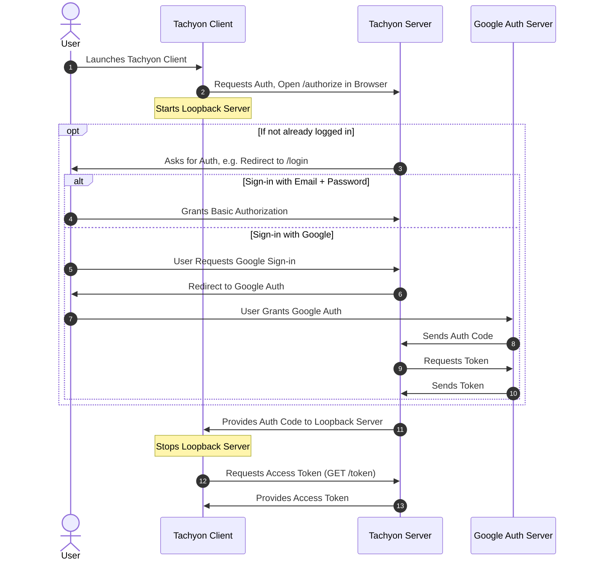
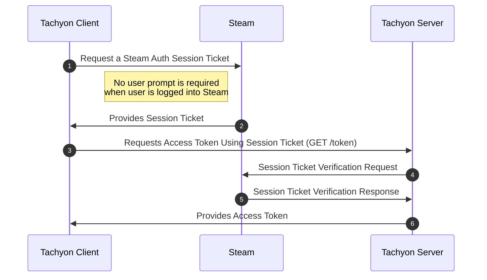

Authorization
=============

> Document status: **Draft** (Pending reference implementation)

To establish a WebSocket connection the client must provide a valid access token. This document outlines the authorization process for interacting with a Tachyon server to gain access as an authenticated user.

The authorization process utilizes the OAuth 2.0 framework as described in [RFC 6749]. Since OAuth 2.0 is an authorization *framework* rather than a fully defined protocol, the rest of the document will focus on specifying the parameters and features that must be implemented by compliant Tachyon servers and clients. Some sections are very short and serve to strengthen the language e.g. replace "should" with "must".

Overview
--------

For the OAuth roles as defined in [Section 1.1 of RFC 6749]:

- **A Tachyon server** fulfills both "authorization server" and "resource server" roles. The "authorization server" is responsible for generating access tokens, and "resource server" is the protocol WebSocket endpoint that will verify those tokens.
- **Player** is the "resource owner".
- **Client Application** (e.g., BAR Lobby) is the "client". Because the lobby is executing fully on Players' computers, the lobby is a "public" client, as defined in [Section 2.1 of RFC 6749].

As the Client Application is a Native Application, it's installed and runs entirely on the player's machine, the client and server must implement the flow as defined in [RFC 8252] "OAuth 2.0 for Native Apps". At a high level, it corresponds to the "Authorization Code Grant" as defined in [Section 4.1 of RFC 6749], but with additional requirements like for example:

- Usage of "Proof Key for Code Exchange" defined in [RFC 7636]
- Additional rules around redirect URI validation
- Rules around binding to loopback interface for clients
- Many security considerations

In addition to the Client Application that acts as an individual player, there are also Bot accounts that have to authenticate in a fully non-interactive way, so not following the authorization code grant flow. This specification opts for the "Client Credentials Grant" as defined in [Section 4.4 of RFC 6749] for this use case.

The client and server should follow the [OAuth 2.0 Security Best Current Practice] and the [OAuth 2.1 draft].

Endpoints Discovery
-------------------

OAuth2 specification doesn't prescribe specific paths for various protocol endpoints. To assist clients, the server must implement the [RFC 8414] "OAuth 2.0 Authorization Server Metadata" and make the JSON metadata document available at the well-known path `/.well-known/oauth-authorization-server`.

Clients must not hardcode any OAuth2 endpoints except for the well-known metadata path, but have to resolve them using the metadata endpoint. Clients can cache the metadata response but must comply with the parameters returned via the standard HTTP `Cache-Control` header.

> ***TODO**: Should Tachyon WebSocket endpoint be also defined in the metadata under a custom key? Or should we use a different well-known address that contains the OAuth2 config as subconfiguration?*

Access Scopes
-------------

OAuth2 allows clients to specify the scope of requested access, see [Section 3.3 of RFC 6749]. To access the Tachyon WebSocket endpoint, the client has to acquire the access token for the custom scope `tachyon.lobby`. Clients must explicitly request the `tachyon.lobby` scope in the authorization request to allow servers more easily fulfill roles other than those required by the Tachyon protocol.

Client Authentication
---------------------

Extending [Section 2.3 of RFC 6749], for all "public clients", the sever *must not* require any client authentication. 

Client Registration
-------------------

Client registration is out of scope of this document.

### Generic Public Client

Servers should provide the generic public client registration. Different lobby implementations can make use of this registration as a starting point. The parameters (names as defined in [Section 2 and 3 of RFC 7591]) for it are:

- `client_id`: `generic_lobby`
- `client_name`: "Generic Lobby Client"
- `redirect_uris`: `httpL://localhost/oauth2callback`
  - Reminder that servera must validate the redirect URI following [Section 7.3 of RFC 8252]
- `token_endpoint_auth_method`: `none`
- `grant_types`: `authorization_code`, `refresh_token`
- `response_types`: `code`
- `scope`: `tachyon.lobby`
  - Server should reject access to any other scopes for the generic client

It's recommended that any official lobbies use dedicated registration. Dedicated registration should be required to be able to access any other resources outside of the Tachyon lobby protocol endpoint.

Sign Out
--------

To support signing out, clients and servers must implement the [RFC 7009] "OAuth 2.0 Token Revocation" and use it to revoke the refresh tokens.

API Authorization
-----------------

Access tokens must be passed to the Tachyon server in accordance with the [RFC 6750] "The OAuth 2.0 Authorization Framework: Bearer Token Usage". This includes the WebSocket endpoint.

Authorization Flows
-------------------

### Interactive for Native Clients

As outlined in the overview, native applications must use the flow as described in the [RFC 8414] for the interactive player sign in process. After the interactive flow is finished, the lobby should use the received refresh token to obtain new access tokens because access tokens have short expiration time.

#### Sequence



#### Example

1. Client calls the well known metadata endpoint to receive the OAuth2 endpoint URLs.
2. Client generates the PKCE code verifier and challenge.
3. Client starts HTTP server listening on the random port on the loopback interface.
4. Client opens server authorization page in the web browser, like:

   `https://tachyon-server.example.com/oauth2/authorize?response_type=code&redirect_uri=http%3A%2F%2F127.0.0.1%3A37589%2Foauth2callback&client_id={client_id}&code_challenge_method=S256&code_challenge={code_challenge}`

5. Server initiates the authentication flow for the user. Server can use any method it wants, for example:

   - Email and password
   - Passkey
   - Start a second OAuth2 flow to log in using other identity providers e.g. Google or Steam.

6. User logs in.

7. Server presents the consent screen to the user that contains the client name and the requested scopes.

8. User approves the consent screen.

9. Server redirects the user to the client redirect URI with the authorization code, like:

   `http://127.0.0.1:37589/oauth2callback?code={authorization_code}`

10. Client receives the authorization code and calls the token endpoint to exchange it for the access token:

    `https://tachyon-server.example.com/oauth2/token?grant_type=authorization_code&code={authorization_code}&redirect_uri=http%3A%2F%2F127.0.0.1%3A37589%2Foauth2callback&client_id={client_id}&code_verifier={code_verifier}`

11. Server validates the authorization code and PKCE code verifier, then returns the access token and refresh token.

### Non-Interactive for Native Clients

If the Client Application runs under software such as the [Steam](https://store.steampowered.com/) client, and the Player is already authenticated there, the client may prefer to authenticate directly as the Steam user without triggering the interactive workflow through a web browser.

For these non-interactive flows the client and server should also use OAuth2 and implement the [RFC 8693] "OAuth 2.0 Token Exchange" flow with the custom token type. The server must not generate any refresh tokens as the Client Authentication is tied to the session open in, for example, Steam and not to the Client Application.

#### Sequence



#### Example

This example is only for demonstration purposes. We use the concepts as described on the Steam documentation <https://partner.steamgames.com/doc/features/auth>.

1. The Client Application receives the Steam auth session ticket by calling [ISteamUser::GetAuthTicketForWebApi](https://partner.steamgames.com/doc/api/ISteamUser#GetAuthTicketForWebApi) from the Steam SDK.
2. Client sends the POST token exchange request to the token endpoint with following `application/x-www-form-urlencoded` encoded parameters:

   ```ini
   client_id={client_id}
   grant_type=urn:ietf:params:oauth:grant-type:token-exchange
   scope=tachyon.lobby
   requested_token_type=urn:ietf:params:oauth:token-type:access_token
   subject_token_type=urn:tachyon:oauth:token-type:steam_session_ticket
   subject_token={steam_session_ticket}
   ```

3. Server calls the Steam API's [ISteamUserAuth/AuthenticateUserTicket](https://partner.steamgames.com/doc/webapi/ISteamUserAuth#AuthenticateUserTicket) to verify the session ticket.
4. After validating the session ticket, the server generates and returns a valid access token to the client.

### Bots

Bot accounts operate exclusively on the server side and require a non-interactive authentication flow. In OAuth2 terms, Bots need to be authorized using a 2-legged flow, involving only the client and the server

Servers must implement the "Client Credentials Grant" flow as defined in [Section 4.4 of RFC 6749] for Bots. The client must use the `client_credentials` grant type and the `tachyon.lobby` scope. The client registration process for Bots is out of scope of this document.

Servers may also implement alternative authorization flows for Bots. One example alternative is the JWT Bearer Token flow as defined in [RFC 7523] and used, for instance, in [Microsoft Entra](https://learn.microsoft.com/en-us/entra/identity-platform/v2-oauth2-client-creds-grant-flow) and [Google APIs](https://developers.google.com/identity/protocols/oauth2/service-account).

<!-- Links -->

<!-- RFC 6749 - The OAuth 2.0 Authorization Framework -->
[RFC 6749]: https://tools.ietf.org/html/rfc6749
[Section 1.1 of RFC 6749]: https://tools.ietf.org/html/rfc6749#section-1.1
[Section 2.1 of RFC 6749]: https://tools.ietf.org/html/rfc6749#section-2.1
[Section 2.3 of RFC 6749]: https://tools.ietf.org/html/rfc6749#section-2.3
[Section 3.3 of RFC 6749]: https://tools.ietf.org/html/rfc6749#section-3.3
[Section 4.1 of RFC 6749]: https://tools.ietf.org/html/rfc6749#section-4.1
[Section 4.4 of RFC 6749]: https://tools.ietf.org/html/rfc6749#section-4.4
<!-- RFC 6750 - The OAuth 2.0 Authorization Framework: Bearer Token Usage -->
[RFC 6750]: https://tools.ietf.org/html/rfc6750
<!-- RFC 7009 - OAuth 2.0 Token Revocation -->
[RFC 7009]: https://tools.ietf.org/html/rfc7009
<!-- RFC 7523 - JSON Web Token (JWT) Profile for OAuth 2.0 Client Authentication and Authorization Grants -->
[RFC 7523]: https://tools.ietf.org/html/rfc7523
<!-- RFC 7591 - OAuth 2.0 Dynamic Client Registration Protocol -->
[Section 2 and 3 of RFC 7591]: https://tools.ietf.org/html/rfc7591#section-2
<!-- RFC 7636 - Proof Key for Code Exchange by OAuth Public Clients -->
[RFC 7636]: https://tools.ietf.org/html/rfc7636
<!-- RFC 8252 - OAuth 2.0 for Native Apps -->
[RFC 8252]: https://tools.ietf.org/html/rfc8252
[Section 7.3 of RFC 8252]: https://tools.ietf.org/html/rfc8252#section-7.3
<!-- RFC 8414 - OAuth 2.0 Authorization Server Metadata -->
[RFC 8414]: https://tools.ietf.org/html/rfc8414
<!-- RFC 8693 - OAuth 2.0 Token Exchange -->
[RFC 8693]: https://tools.ietf.org/html/rfc8693
[OAuth 2.0 Security Best Current Practice]: https://datatracker.ietf.org/doc/html/draft-ietf-oauth-security-topics
[OAuth 2.1 draft]: https://oauth.net/2.1/