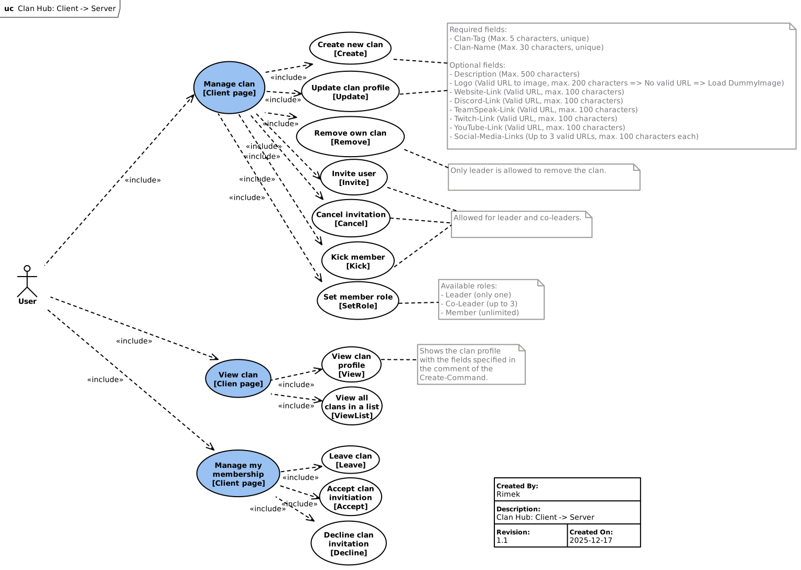
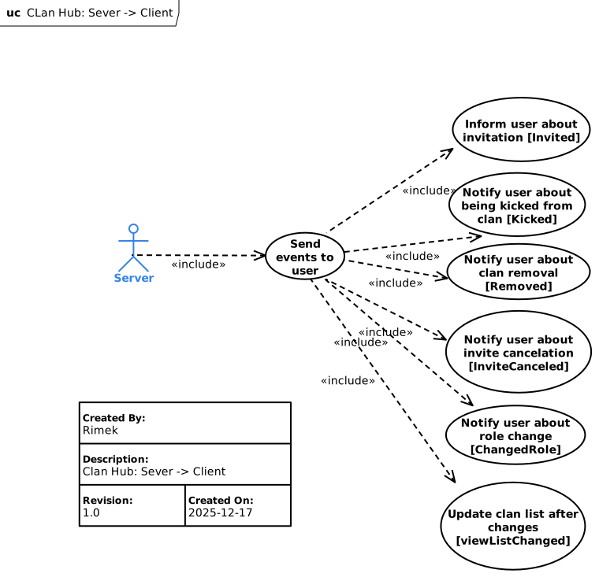

<!-- THIS FILE IS AUTOMATICALLY GENERATED, PLEASE DO NOT EDIT IT MANUALLY -->

# Clan

Clans are a permanent kind of party with additional features.

A clan has a profil which includes several information like tag, name, description. The following use-case diagrams gives an overview about the topics which has to be handled with this schema:





### Manage clan

Every user is allowed to create a clan with [create](#create). Then he is the clan leader. The clan leader is the only one who is allowed to delete the clan with the request [remove](#remove).

Clan leader and clan co-leaders are able to the profile [update](#update).

Clan leader and clan co-leaders are allowed to invite different players with [invite](#invite). (There are no limitations of the count of members.) The invitation can be cancelled by [cancelInvite](#cancelinvite). Invited players can accept invitiation by [acceptInvite](#acceptinvite) and decline by [declineInvite](#declineinvite).

Only the clan-leader is able to kick members by [kickMember](#kickmember). Similarly, any member can leave the clan they are currently in with [leave](#leave).

The clan leader is allowed to appoint up to three members as clan co-leader with [setRole](#setrole). The clan leader has also the possibility to overtake his leadership to a different member with the same command. (ATTENTION: By executing this command the clan leader loses his permissions!)

### Special use cases

If the clan-leader leaves the clan by clan/leave the oldest co-leader is set as new clan leader. If no co-leader exist the oldest member is set as new clan leader.

If the clan-leader leaves the clan and he is the last member the clan will be removed.

---

- [acceptInvite](#acceptinvite)
- [cancelInvite](#cancelinvite)
- [create](#create)
- [declineInvite](#declineinvite)
- [get](#get)
- [getList](#getlist)
- [invite](#invite)
- [invited](#invited)
- [kickMember](#kickmember)
- [leave](#leave)
- [remove](#remove)
- [setRole](#setrole)
- [update](#update)
- [updateList](#updatelist)

---

## AcceptInvite

Accept an invite to a clan.

- Endpoint Type:**Request** ->**Response**
- Source:**User**
- Target:**Server**
- Required Scopes:`tachyon.lobby`

### Request

<details>
<summary>JSONSchema</summary>

```json
{
    "title": "ClanAcceptInviteRequest",
    "tachyon": {
        "source": "user",
        "target": "server",
        "scopes": ["tachyon.lobby"]
    },
    "type": "object",
    "properties": {
        "type": { "const": "request" },
        "messageId": { "type": "string" },
        "commandId": { "const": "clan/acceptInvite" },
        "data": {
            "title": "ClanAcceptInviteRequestData",
            "type": "object",
            "properties": {
                "userId": { "$ref": "#/definitions/userId" },
                "clanId": { "$ref": "#/definitions/clanId" }
            },
            "required": ["userId", "clanId"]
        }
    },
    "required": ["type", "messageId", "commandId", "data"]
}

```

</details>

<details>
<summary>Example</summary>

```json
{
    "type": "request",
    "messageId": "proident adipisicing",
    "commandId": "clan/acceptInvite",
    "data": {
        "userId": "351",
        "clanId": "12345"
    }
}
```

</details>

#### TypeScript Definition

```ts
export type UserId = string;
export type ClanId = string;

export interface ClanAcceptInviteRequest {
    type: "request";
    messageId: string;
    commandId: "clan/acceptInvite";
    data: ClanAcceptInviteRequestData;
}
export interface ClanAcceptInviteRequestData {
    userId: UserId;
    clanId: ClanId;
}
```

### Response

<details>
<summary>JSONSchema</summary>

```json
{
    "title": "ClanAcceptInviteResponse",
    "tachyon": {
        "source": "server",
        "target": "user",
        "scopes": ["tachyon.lobby"]
    },
    "anyOf": [
        {
            "title": "ClanAcceptInviteOkResponse",
            "type": "object",
            "properties": {
                "type": { "const": "response" },
                "messageId": { "type": "string" },
                "commandId": { "const": "clan/acceptInvite" },
                "status": { "const": "success" }
            },
            "required": ["type", "messageId", "commandId", "status"]
        },
        {
            "title": "ClanAcceptInviteFailResponse",
            "type": "object",
            "properties": {
                "type": { "const": "response" },
                "messageId": { "type": "string" },
                "commandId": { "const": "clan/acceptInvite" },
                "status": { "const": "failed" },
                "reason": {
                    "enum": [
                        "internal_error",
                        "unauthorized",
                        "invalid_request",
                        "command_unimplemented"
                    ]
                },
                "details": { "type": "string" }
            },
            "required": ["type", "messageId", "commandId", "status", "reason"]
        }
    ]
}

```

</details>

<details>
<summary>Example</summary>

```json
{
    "type": "response",
    "messageId": "Ut ipsum",
    "commandId": "clan/acceptInvite",
    "status": "success"
}
```

</details>

#### TypeScript Definition

```ts
export interface ClanAcceptInviteOkResponse {
    type: "response";
    messageId: string;
    commandId: "clan/acceptInvite";
    status: "success";
}
```

Possible Failed Reasons: `internal_error`, `unauthorized`, `invalid_request`, `command_unimplemented`

---

## CancelInvite

Cancel an invite to your clan.

- Endpoint Type:**Request** ->**Response**
- Source:**User**
- Target:**Server**
- Required Scopes:`tachyon.lobby`

### Request

<details>
<summary>JSONSchema</summary>

```json
{
    "title": "ClanCancelInviteRequest",
    "tachyon": {
        "source": "user",
        "target": "server",
        "scopes": ["tachyon.lobby"]
    },
    "type": "object",
    "properties": {
        "type": { "const": "request" },
        "messageId": { "type": "string" },
        "commandId": { "const": "clan/cancelInvite" },
        "data": {
            "title": "ClanCancelInviteRequestData",
            "type": "object",
            "properties": {
                "userId": { "$ref": "#/definitions/userId" },
                "clanId": { "$ref": "#/definitions/clanId" }
            },
            "required": ["userId", "clanId"]
        }
    },
    "required": ["type", "messageId", "commandId", "data"]
}

```

</details>

<details>
<summary>Example</summary>

```json
{
    "type": "request",
    "messageId": "laboris fugiat",
    "commandId": "clan/cancelInvite",
    "data": {
        "userId": "351",
        "clanId": "12345"
    }
}
```

</details>

#### TypeScript Definition

```ts
export type UserId = string;
export type ClanId = string;

export interface ClanCancelInviteRequest {
    type: "request";
    messageId: string;
    commandId: "clan/cancelInvite";
    data: ClanCancelInviteRequestData;
}
export interface ClanCancelInviteRequestData {
    userId: UserId;
    clanId: ClanId;
}
```

### Response

<details>
<summary>JSONSchema</summary>

```json
{
    "title": "ClanCancelInviteResponse",
    "tachyon": {
        "source": "server",
        "target": "user",
        "scopes": ["tachyon.lobby"]
    },
    "anyOf": [
        {
            "title": "ClanCancelInviteOkResponse",
            "type": "object",
            "properties": {
                "type": { "const": "response" },
                "messageId": { "type": "string" },
                "commandId": { "const": "clan/cancelInvite" },
                "status": { "const": "success" }
            },
            "required": ["type", "messageId", "commandId", "status"]
        },
        {
            "title": "ClanCancelInviteFailResponse",
            "type": "object",
            "properties": {
                "type": { "const": "response" },
                "messageId": { "type": "string" },
                "commandId": { "const": "clan/cancelInvite" },
                "status": { "const": "failed" },
                "reason": {
                    "enum": [
                        "internal_error",
                        "unauthorized",
                        "invalid_request",
                        "command_unimplemented"
                    ]
                },
                "details": { "type": "string" }
            },
            "required": ["type", "messageId", "commandId", "status", "reason"]
        }
    ]
}

```

</details>

<details>
<summary>Example</summary>

```json
{
    "type": "response",
    "messageId": "Duis",
    "commandId": "clan/cancelInvite",
    "status": "success"
}
```

</details>

#### TypeScript Definition

```ts
export interface ClanCancelInviteOkResponse {
    type: "response";
    messageId: string;
    commandId: "clan/cancelInvite";
    status: "success";
}
```

Possible Failed Reasons: `internal_error`, `unauthorized`, `invalid_request`, `command_unimplemented`

---

## Create

Create a clan.

- Endpoint Type:**Request** ->**Response**
- Source:**User**
- Target:**Server**
- Required Scopes:`tachyon.lobby`

### Request

<details>
<summary>JSONSchema</summary>

```json
{
    "title": "ClanCreateRequest",
    "tachyon": {
        "source": "user",
        "target": "server",
        "scopes": ["tachyon.lobby"]
    },
    "type": "object",
    "properties": {
        "type": { "const": "request" },
        "messageId": { "type": "string" },
        "commandId": { "const": "clan/create" },
        "data": {
            "title": "ClanCreateRequestData",
            "type": "object",
            "properties": { "clan": { "$ref": "#/definitions/clan" } },
            "required": ["clan"]
        }
    },
    "required": ["type", "messageId", "commandId", "data"]
}

```

</details>

<details>
<summary>Example</summary>

```json
{
    "type": "request",
    "messageId": "cillum Excepteur consectetur dolore commodo",
    "commandId": "clan/create",
    "data": {
        "clan": {
            "clanId": "12345",
            "tag": "moll",
            "name": "eiusmod ut ",
            "description": "nulla sint quis ad",
            "websiteUrl": "http://NlSjYmbeyWTUEkpgfXpcXnPQEQu.yqzQQHqDFwgep3PcETq0kpp6ayVAakNZ5Eel5I-XP1hKc,7yK8zVjdDMeJlz-eTHdxjPl",
            "discordUrl": "https://fG.qcvyQwtzh443YbpdH5CHG2e6ySpuLOR,K3r3AgkwANuRgd--Xi0Hu2xz5vcd0.Yqd5gy",
            "teamspeakUrl": "http://qKfUBFUCamFiGcui.usztstkQv,DXK9OgN1",
            "twitterUrl": "https://lL.mceej-N-oZ"
        }
    }
}
```

</details>

#### TypeScript Definition

```ts
export type ClanId = string;

export interface ClanCreateRequest {
    type: "request";
    messageId: string;
    commandId: "clan/create";
    data: ClanCreateRequestData;
}
export interface ClanCreateRequestData {
    clan: Clan;
}
export interface Clan {
    clanId: ClanId;
    tag: string;
    name: string;
    description?: string;
    logoUrl?: string;
    websiteUrl?: string;
    discordUrl?: string;
    teamspeakUrl?: string;
    twitchUrl?: string;
    youtubeUrl?: string;
    facebookUrl?: string;
    twitterUrl?: string;
}
```

### Response

<details>
<summary>JSONSchema</summary>

```json
{
    "title": "ClanCreateResponse",
    "tachyon": {
        "source": "server",
        "target": "user",
        "scopes": ["tachyon.lobby"]
    },
    "anyOf": [
        {
            "title": "ClanCreateOkResponse",
            "type": "object",
            "properties": {
                "type": { "const": "response" },
                "messageId": { "type": "string" },
                "commandId": { "const": "clan/create" },
                "status": { "const": "success" }
            },
            "required": ["type", "messageId", "commandId", "status"]
        },
        {
            "title": "ClanCreateFailResponse",
            "type": "object",
            "properties": {
                "type": { "const": "response" },
                "messageId": { "type": "string" },
                "commandId": { "const": "clan/create" },
                "status": { "const": "failed" },
                "reason": {
                    "enum": [
                        "tag_already_exists",
                        "name_already_exists",
                        "internal_error",
                        "unauthorized",
                        "invalid_request",
                        "command_unimplemented"
                    ]
                },
                "details": { "type": "string" }
            },
            "required": ["type", "messageId", "commandId", "status", "reason"]
        }
    ]
}

```

</details>

<details>
<summary>Example</summary>

```json
{
    "type": "response",
    "messageId": "esse amet irure fugiat dolore",
    "commandId": "clan/create",
    "status": "success"
}
```

</details>

#### TypeScript Definition

```ts
export interface ClanCreateOkResponse {
    type: "response";
    messageId: string;
    commandId: "clan/create";
    status: "success";
}
```

Possible Failed Reasons: `tag_already_exists`, `name_already_exists`, `internal_error`, `unauthorized`, `invalid_request`, `command_unimplemented`

---

## DeclineInvite

Decline an invite to a clan.

- Endpoint Type:**Request** ->**Response**
- Source:**User**
- Target:**Server**
- Required Scopes:`tachyon.lobby`

### Request

<details>
<summary>JSONSchema</summary>

```json
{
    "title": "ClanDeclineInviteRequest",
    "tachyon": {
        "source": "user",
        "target": "server",
        "scopes": ["tachyon.lobby"]
    },
    "type": "object",
    "properties": {
        "type": { "const": "request" },
        "messageId": { "type": "string" },
        "commandId": { "const": "clan/declineInvite" },
        "data": {
            "title": "ClanDeclineInviteRequestData",
            "type": "object",
            "properties": {
                "userId": { "$ref": "#/definitions/userId" },
                "clanId": { "$ref": "#/definitions/clanId" }
            },
            "required": ["userId", "clanId"]
        }
    },
    "required": ["type", "messageId", "commandId", "data"]
}

```

</details>

<details>
<summary>Example</summary>

```json
{
    "type": "request",
    "messageId": "culpa in consectetur esse",
    "commandId": "clan/declineInvite",
    "data": {
        "userId": "351",
        "clanId": "12345"
    }
}
```

</details>

#### TypeScript Definition

```ts
export type UserId = string;
export type ClanId = string;

export interface ClanDeclineInviteRequest {
    type: "request";
    messageId: string;
    commandId: "clan/declineInvite";
    data: ClanDeclineInviteRequestData;
}
export interface ClanDeclineInviteRequestData {
    userId: UserId;
    clanId: ClanId;
}
```

### Response

<details>
<summary>JSONSchema</summary>

```json
{
    "title": "ClanDeclineInviteResponse",
    "tachyon": {
        "source": "server",
        "target": "user",
        "scopes": ["tachyon.lobby"]
    },
    "anyOf": [
        {
            "title": "ClanDeclineInviteOkResponse",
            "type": "object",
            "properties": {
                "type": { "const": "response" },
                "messageId": { "type": "string" },
                "commandId": { "const": "clan/declineInvite" },
                "status": { "const": "success" }
            },
            "required": ["type", "messageId", "commandId", "status"]
        },
        {
            "title": "ClanDeclineInviteFailResponse",
            "type": "object",
            "properties": {
                "type": { "const": "response" },
                "messageId": { "type": "string" },
                "commandId": { "const": "clan/declineInvite" },
                "status": { "const": "failed" },
                "reason": {
                    "enum": [
                        "internal_error",
                        "unauthorized",
                        "invalid_request",
                        "command_unimplemented"
                    ]
                },
                "details": { "type": "string" }
            },
            "required": ["type", "messageId", "commandId", "status", "reason"]
        }
    ]
}

```

</details>

<details>
<summary>Example</summary>

```json
{
    "type": "response",
    "messageId": "Duis labore nostrud sint",
    "commandId": "clan/declineInvite",
    "status": "success"
}
```

</details>

#### TypeScript Definition

```ts
export interface ClanDeclineInviteOkResponse {
    type: "response";
    messageId: string;
    commandId: "clan/declineInvite";
    status: "success";
}
```

Possible Failed Reasons: `internal_error`, `unauthorized`, `invalid_request`, `command_unimplemented`

---

## Get

Get information about a clan.

- Endpoint Type:**Request** ->**Response**
- Source:**User**
- Target:**Server**
- Required Scopes:`tachyon.lobby`

### Request

<details>
<summary>JSONSchema</summary>

```json
{
    "title": "ClanGetRequest",
    "tachyon": {
        "source": "user",
        "target": "server",
        "scopes": ["tachyon.lobby"]
    },
    "type": "object",
    "properties": {
        "type": { "const": "request" },
        "messageId": { "type": "string" },
        "commandId": { "const": "clan/get" },
        "data": {
            "title": "ClanGetRequestData",
            "type": "object",
            "properties": { "clanId": { "$ref": "#/definitions/clanId" } },
            "required": ["clanId"]
        }
    },
    "required": ["type", "messageId", "commandId", "data"]
}

```

</details>

<details>
<summary>Example</summary>

```json
{
    "type": "request",
    "messageId": "fugiat",
    "commandId": "clan/get",
    "data": {
        "clanId": "12345"
    }
}
```

</details>

#### TypeScript Definition

```ts
export type ClanId = string;

export interface ClanGetRequest {
    type: "request";
    messageId: string;
    commandId: "clan/get";
    data: ClanGetRequestData;
}
export interface ClanGetRequestData {
    clanId: ClanId;
}
```

### Response

<details>
<summary>JSONSchema</summary>

```json
{
    "title": "ClanGetResponse",
    "tachyon": {
        "source": "server",
        "target": "user",
        "scopes": ["tachyon.lobby"]
    },
    "anyOf": [
        {
            "title": "ClanGetOkResponse",
            "type": "object",
            "properties": {
                "type": { "const": "response" },
                "messageId": { "type": "string" },
                "commandId": { "const": "clan/get" },
                "status": { "const": "success" },
                "data": {
                    "$ref": "#/definitions/clan",
                    "title": "ClanGetOkResponseData"
                }
            },
            "required": ["type", "messageId", "commandId", "status", "data"]
        },
        {
            "title": "ClanGetFailResponse",
            "type": "object",
            "properties": {
                "type": { "const": "response" },
                "messageId": { "type": "string" },
                "commandId": { "const": "clan/get" },
                "status": { "const": "failed" },
                "reason": {
                    "enum": [
                        "clan_does_not_exist",
                        "internal_error",
                        "unauthorized",
                        "invalid_request",
                        "command_unimplemented"
                    ]
                },
                "details": { "type": "string" }
            },
            "required": ["type", "messageId", "commandId", "status", "reason"]
        }
    ]
}

```

</details>

<details>
<summary>Example</summary>

```json
{
    "type": "response",
    "messageId": "elit",
    "commandId": "clan/get",
    "status": "success",
    "data": {
        "clanId": "12345",
        "tag": "paria",
        "name": "ut consectetur",
        "teamspeakUrl": "https://fVYfOUFFMqstDvkNkVUzTPsHNulvmBkx.qcfbO00rzPng",
        "twitchUrl": "http://WdfWgcFJKMWpBTupGVQUFsouy.xwptJGKnBs-Dl0kQQRncy9TMrYMI",
        "youtubeUrl": "http://EtOy.gknS-P1RbfEnJQ5vVVyVWublcFepl1sZpAaegO3b,.M,MTDN+iHmTz8sevsX6FKClbGV0JfJfHr8Ik8"
    }
}
```

</details>

#### TypeScript Definition

```ts
export type ClanId = string;

export interface ClanGetOkResponse {
    type: "response";
    messageId: string;
    commandId: "clan/get";
    status: "success";
    data: ClanGetOkResponseData;
}
export interface ClanGetOkResponseData {
    clanId: ClanId;
    tag: string;
    name: string;
    description?: string;
    logoUrl?: string;
    websiteUrl?: string;
    discordUrl?: string;
    teamspeakUrl?: string;
    twitchUrl?: string;
    youtubeUrl?: string;
    facebookUrl?: string;
    twitterUrl?: string;
}
```

Possible Failed Reasons: `clan_does_not_exist`, `internal_error`, `unauthorized`, `invalid_request`, `command_unimplemented`

---

## GetList

Get the list of clans

- Endpoint Type:**Request** ->**Response**
- Source:**User**
- Target:**Server**
- Required Scopes:`tachyon.lobby`

### Request

<details>
<summary>JSONSchema</summary>

```json
{
    "title": "ClanGetListRequest",
    "tachyon": {
        "source": "user",
        "target": "server",
        "scopes": ["tachyon.lobby"]
    },
    "type": "object",
    "properties": {
        "type": { "const": "request" },
        "messageId": { "type": "string" },
        "commandId": { "const": "clan/getList" }
    },
    "required": ["type", "messageId", "commandId"]
}

```

</details>

<details>
<summary>Example</summary>

```json
{
    "type": "request",
    "messageId": "tempor Ut consequat deserunt",
    "commandId": "clan/getList"
}
```

</details>

#### TypeScript Definition

```ts
export interface ClanGetListRequest {
    type: "request";
    messageId: string;
    commandId: "clan/getList";
}
```

### Response

<details>
<summary>JSONSchema</summary>

```json
{
    "title": "ClanGetListResponse",
    "tachyon": {
        "source": "server",
        "target": "user",
        "scopes": ["tachyon.lobby"]
    },
    "anyOf": [
        {
            "title": "ClanGetListOkResponse",
            "type": "object",
            "properties": {
                "type": { "const": "response" },
                "messageId": { "type": "string" },
                "commandId": { "const": "clan/getList" },
                "status": { "const": "success" },
                "data": {
                    "title": "ClanGetListOkResponseData",
                    "type": "object",
                    "properties": {
                        "clans": {
                            "type": "array",
                            "items": { "$ref": "#/definitions/clan" }
                        }
                    },
                    "required": ["clans"]
                }
            },
            "required": ["type", "messageId", "commandId", "status", "data"]
        },
        {
            "title": "ClanGetListFailResponse",
            "type": "object",
            "properties": {
                "type": { "const": "response" },
                "messageId": { "type": "string" },
                "commandId": { "const": "clan/getList" },
                "status": { "const": "failed" },
                "reason": {
                    "enum": [
                        "internal_error",
                        "unauthorized",
                        "invalid_request",
                        "command_unimplemented"
                    ]
                },
                "details": { "type": "string" }
            },
            "required": ["type", "messageId", "commandId", "status", "reason"]
        }
    ]
}

```

</details>

<details>
<summary>Example</summary>

```json
{
    "type": "response",
    "messageId": "aliquip",
    "commandId": "clan/getList",
    "status": "success",
    "data": {
        "clans": [
            {
                "clanId": "12345",
                "tag": "culp",
                "name": "laborum mollit labor",
                "youtubeUrl": "http://CpoCHkiNuWwF.rgrLLk7SSizAOrdJ3vAyceVGok4iAkDeVE9XCLBVkU6t0gjJ.",
                "facebookUrl": "http://bUcIvfjlx.rcnFSHkMKJc1JC6QEZv0glXXU0+xiOQlZhtqcxJhcWgjV4wHMSkdQUuA9KCSwBcjpw2eCh",
                "twitterUrl": "http://fFOQcEKDqRZiaSsGvoXEOxyWlg.eiaHwg4O0L-gEpHBJ9EZ,KRvIg,MuWVfOwi"
            },
            {
                "clanId": "12345",
                "tag": "est",
                "name": "sunt",
                "description": "minim magna labore amet ullamco",
                "logoUrl": "http://mXdFXUNT.chswsRXgIHEcfBhMBvVsCMOPmyJrrV88WKOmDMLNz6uU06XuggHGRcONm0Pk0eUN0SHha589tIN3w",
                "websiteUrl": "https://cBgjSWeQzppoINrrfocvGsKmAyjSC.yllBOO+SLqoJ3PWl-Xh7nVFO8P9X-nTqVD34Ff0Ctxx,u",
                "discordUrl": "https://KOtoqayfWiiUNrsBwpDuIgfRyrLlnd.nmiVkesGrnzUDGz7nUyFPsdEKs9+grl0amB..bYpeGk4kMQ4Hn.rU4Ri",
                "teamspeakUrl": "https://tPsClOjcgcqcBeqmw.bhcjM8DFaZXvAf7SXjXA.fd8dt2QjXJhwS,3pfPEDIX",
                "twitchUrl": "http://DLKWvBNaqHOoQhcRJEdiIQGenG.seuzm1bNqMzBrdvqBSwYkPvZ1ngQb3N0EOoOehM0Gp-y9l2wLNpcNUbbkid3e4",
                "youtubeUrl": "http://TEocGRQxBELeWVZoHMcOiC.llbgcasWfWxFC",
                "facebookUrl": "http://UVIpzCtdcpbIaDgiUGKiKo.aagjcSU9s9dO8WODEQNBFbVByRL14JTQWg",
                "twitterUrl": "https://EHiWFXnK.rkKEkW6Po9U14FNwQwTii+wKkmeaoTxpMLMAWvUgVX3aVbjx.VzJY2NJxgqUln3"
            },
            {
                "clanId": "12345",
                "tag": "lab",
                "name": "eiusmod",
                "description": "Ut",
                "websiteUrl": "https://SgGpreyjDLCocMTDHZIHVRrqOetRsp.bpEJC0sdxRMdZ9u.bXFu9ksZU,LVViiY4OZxZdfhbFxOtBnm0ly",
                "discordUrl": "https://GmYnxPuYznmXHLlN.dqyewV93lAQ4aSyyqAoz1XOb8DNmmfqm0ZGgapPW9o4EAWfziS06+7V",
                "teamspeakUrl": "http://jXROsMTWXomBlCOOAxOmSRZjegIPliHFk.fwxOIIwwGH3uWlBZdG+Y2JRplPPkaqgAI,gjcLGPP,eQrK,YrgKEwwLDJ5XMGLk9Fq.KocbW",
                "twitchUrl": "https://SbJgLuwzxQyQUAHTJLhVm.nraiQ,o1SofhQMD1X5JFm",
                "youtubeUrl": "http://ernRYFjGnIvyBtdbZykzcyXT.mapfLmR8m",
                "facebookUrl": "http://BvABUIXsgTaFTwIKKFwEKruj.vdzvJfhDiMd7f4UEnXjOW"
            },
            {
                "clanId": "12345",
                "tag": "con",
                "name": "es",
                "websiteUrl": "http://jdAoCeeDQMQiuHVVmlPfceyiwP.lsmUDHSy-LD1hnU6tspOoaccoMJmAswd2,KcyuglIn8tH60vjP0B34W,18ZJi9zXA2MUX,",
                "discordUrl": "http://qoEBZBgewIuColiyuXHUbSb.etcaXrv5IU8gbKa",
                "teamspeakUrl": "https://oiMx.ssrYaTiZZg-za9m.F8GCMNHNS2vpli8K1rLWRMvyf,NtLBkY6r",
                "facebookUrl": "https://grWVEr.tvrqjbwzNon-pVoxSFyPlcb-lpgd2HZUVaLCPAIpJWHqJt4CvHEfaeU4xGhn3Ll6xHJ",
                "twitterUrl": "http://YFnAxWmAZa.sgmP5d6s4uwBnVKpAAgLN.Ynpj7U,OwpnPVOzT9x-ZvDmy9etOQO8JXfeZEmkE7q0vUyGBRYME-0P"
            },
            {
                "clanId": "12345",
                "tag": "est ",
                "name": "dolore ut ",
                "description": "sint amet nulla",
                "logoUrl": "https://DWvWbsWjiHWaxNLkDTFemlDE.zteT1NFByBuzzryO,-.p5+",
                "websiteUrl": "https://PXTlADVPwvUjsTcFnkfwfJ.cqdgYeBvLR50A+dlxCIyKYx",
                "discordUrl": "https://YymfbWGGYtGpWyhALyFPIzWbkjK.bjnK1RiwzEWYl0j,EW-685g+DGQqzaDWmNl3N",
                "teamspeakUrl": "http://tQT.ywzvv7dFdsHOLHs+1AQnhBU",
                "youtubeUrl": "https://xmhsbIZjoe.nlhppusZshTShcVjvQwrzj0EtQlE",
                "facebookUrl": "https://wZwVSnkKpKkiRShRHraa.cglx+QeVnghl3+ZCMskieDS",
                "twitterUrl": "https://Yjs.ecp-HvrraLYV"
            }
        ]
    }
}
```

</details>

#### TypeScript Definition

```ts
export type ClanId = string;

export interface ClanGetListOkResponse {
    type: "response";
    messageId: string;
    commandId: "clan/getList";
    status: "success";
    data: ClanGetListOkResponseData;
}
export interface ClanGetListOkResponseData {
    clans: Clan[];
}
export interface Clan {
    clanId: ClanId;
    tag: string;
    name: string;
    description?: string;
    logoUrl?: string;
    websiteUrl?: string;
    discordUrl?: string;
    teamspeakUrl?: string;
    twitchUrl?: string;
    youtubeUrl?: string;
    facebookUrl?: string;
    twitterUrl?: string;
}
```

Possible Failed Reasons: `internal_error`, `unauthorized`, `invalid_request`, `command_unimplemented`

---

## Invite

Invite the target player to your clan.

- Endpoint Type:**Request** ->**Response**
- Source:**User**
- Target:**Server**
- Required Scopes:`tachyon.lobby`

### Request

<details>
<summary>JSONSchema</summary>

```json
{
    "title": "ClanInviteRequest",
    "tachyon": {
        "source": "user",
        "target": "server",
        "scopes": ["tachyon.lobby"]
    },
    "type": "object",
    "properties": {
        "type": { "const": "request" },
        "messageId": { "type": "string" },
        "commandId": { "const": "clan/invite" },
        "data": {
            "title": "ClanInviteRequestData",
            "type": "object",
            "properties": {
                "userId": { "$ref": "#/definitions/userId" },
                "clanId": { "$ref": "#/definitions/clanId" }
            },
            "required": ["userId", "clanId"]
        }
    },
    "required": ["type", "messageId", "commandId", "data"]
}

```

</details>

<details>
<summary>Example</summary>

```json
{
    "type": "request",
    "messageId": "in dolore nulla Lorem",
    "commandId": "clan/invite",
    "data": {
        "userId": "351",
        "clanId": "12345"
    }
}
```

</details>

#### TypeScript Definition

```ts
export type UserId = string;
export type ClanId = string;

export interface ClanInviteRequest {
    type: "request";
    messageId: string;
    commandId: "clan/invite";
    data: ClanInviteRequestData;
}
export interface ClanInviteRequestData {
    userId: UserId;
    clanId: ClanId;
}
```

### Response

<details>
<summary>JSONSchema</summary>

```json
{
    "title": "ClanInviteResponse",
    "tachyon": {
        "source": "server",
        "target": "user",
        "scopes": ["tachyon.lobby"]
    },
    "anyOf": [
        {
            "title": "ClanInviteOkResponse",
            "type": "object",
            "properties": {
                "type": { "const": "response" },
                "messageId": { "type": "string" },
                "commandId": { "const": "clan/invite" },
                "status": { "const": "success" }
            },
            "required": ["type", "messageId", "commandId", "status"]
        },
        {
            "title": "ClanInviteFailResponse",
            "type": "object",
            "properties": {
                "type": { "const": "response" },
                "messageId": { "type": "string" },
                "commandId": { "const": "clan/invite" },
                "status": { "const": "failed" },
                "reason": {
                    "enum": [
                        "not_available",
                        "internal_error",
                        "unauthorized",
                        "invalid_request",
                        "command_unimplemented"
                    ]
                },
                "details": { "type": "string" }
            },
            "required": ["type", "messageId", "commandId", "status", "reason"]
        }
    ]
}

```

</details>

<details>
<summary>Example</summary>

```json
{
    "type": "response",
    "messageId": "qui",
    "commandId": "clan/invite",
    "status": "success"
}
```

</details>

#### TypeScript Definition

```ts
export interface ClanInviteOkResponse {
    type: "response";
    messageId: string;
    commandId: "clan/invite";
    status: "success";
}
```

Possible Failed Reasons: `not_available`, `internal_error`, `unauthorized`, `invalid_request`, `command_unimplemented`

---

## Invited

A player has been invited to a clan. Sent to the invited player.

- Endpoint Type:**Event**
- Source:**Server**
- Target:**User**
- Required Scopes:`tachyon.lobby`

### Event

<details>
<summary>JSONSchema</summary>

```json
{
    "title": "ClanInvitedEvent",
    "tachyon": {
        "source": "server",
        "target": "user",
        "scopes": ["tachyon.lobby"]
    },
    "type": "object",
    "properties": {
        "type": { "const": "event" },
        "messageId": { "type": "string" },
        "commandId": { "const": "clan/invited" },
        "data": {
            "title": "ClanInvitedEventData",
            "type": "object",
            "properties": { "party": { "$ref": "#/definitions/clan" } },
            "required": ["party"]
        }
    },
    "required": ["type", "messageId", "commandId", "data"]
}

```

</details>

<details>
<summary>Example</summary>

```json
{
    "type": "event",
    "messageId": "minim Excepteur Duis",
    "commandId": "clan/invited",
    "data": {
        "party": {
            "clanId": "12345",
            "tag": "id mol",
            "name": "est consequat Excepteur",
            "description": "dolor magna proid",
            "logoUrl": "https://DBbUGQv.fuurDWavgyJK4WyN,idbUUeMA",
            "websiteUrl": "https://UYGt.oopAPRWz9Mkf+WBKj6AB+t8Tt0",
            "discordUrl": "http://ReWQIQMmZoQfMhuEapWjSxwjiIGRjWy.fioseHanKs5JyVr2E1yQvWsIDKvlfbmxmVc6SVCR9HKbnLxutqz2ejD",
            "teamspeakUrl": "https://gWtnsAxnjzgPQsUeFSbADYA.anibVTRfArn8GGopBUrVa7NmOC3ez1P-hCfJVsK,HhzcEH,zBsT",
            "twitchUrl": "http://EkVBpRvLozQDlY.bvfsu6jAmyxMjLL3",
            "youtubeUrl": "http://zdvchzXjicMXEHZSLepxu.kksI43XRsgGVZX91UNaVhtXlyXjtAUTpO1TY2DUB",
            "facebookUrl": "https://TCAlDFCfr.onqggXnGL56cb-AgA-MkhqwYOEhCrwGlhIYybPvMKbPy0,-Xqw",
            "twitterUrl": "http://pwHUYcvJrjmEevftIPW.nufSOCi9bL.C12GyPsZ45lQXc9pbayMuj-4uvsnl4Nzvxp"
        }
    }
}
```

</details>

#### TypeScript Definition

```ts
export type ClanId = string;

export interface ClanInvitedEvent {
    type: "event";
    messageId: string;
    commandId: "clan/invited";
    data: ClanInvitedEventData;
}
export interface ClanInvitedEventData {
    party: Clan;
}
export interface Clan {
    clanId: ClanId;
    tag: string;
    name: string;
    description?: string;
    logoUrl?: string;
    websiteUrl?: string;
    discordUrl?: string;
    teamspeakUrl?: string;
    twitchUrl?: string;
    youtubeUrl?: string;
    facebookUrl?: string;
    twitterUrl?: string;
}
```

---

## KickMember

Kick a member from your clan.

- Endpoint Type:**Request** ->**Response**
- Source:**User**
- Target:**Server**
- Required Scopes:`tachyon.lobby`

### Request

<details>
<summary>JSONSchema</summary>

```json
{
    "title": "ClanKickMemberRequest",
    "tachyon": {
        "source": "user",
        "target": "server",
        "scopes": ["tachyon.lobby"]
    },
    "type": "object",
    "properties": {
        "type": { "const": "request" },
        "messageId": { "type": "string" },
        "commandId": { "const": "clan/kickMember" },
        "data": {
            "title": "ClanKickMemberRequestData",
            "type": "object",
            "properties": {
                "userId": { "$ref": "#/definitions/userId" },
                "clanId": { "$ref": "#/definitions/clanId" }
            },
            "required": ["userId", "clanId"]
        }
    },
    "required": ["type", "messageId", "commandId", "data"]
}

```

</details>

<details>
<summary>Example</summary>

```json
{
    "type": "request",
    "messageId": "eu cillum anim",
    "commandId": "clan/kickMember",
    "data": {
        "userId": "351",
        "clanId": "12345"
    }
}
```

</details>

#### TypeScript Definition

```ts
export type UserId = string;
export type ClanId = string;

export interface ClanKickMemberRequest {
    type: "request";
    messageId: string;
    commandId: "clan/kickMember";
    data: ClanKickMemberRequestData;
}
export interface ClanKickMemberRequestData {
    userId: UserId;
    clanId: ClanId;
}
```

### Response

<details>
<summary>JSONSchema</summary>

```json
{
    "title": "ClanKickMemberResponse",
    "tachyon": {
        "source": "server",
        "target": "user",
        "scopes": ["tachyon.lobby"]
    },
    "anyOf": [
        {
            "title": "ClanKickMemberOkResponse",
            "type": "object",
            "properties": {
                "type": { "const": "response" },
                "messageId": { "type": "string" },
                "commandId": { "const": "clan/kickMember" },
                "status": { "const": "success" }
            },
            "required": ["type", "messageId", "commandId", "status"]
        },
        {
            "title": "ClanKickMemberFailResponse",
            "type": "object",
            "properties": {
                "type": { "const": "response" },
                "messageId": { "type": "string" },
                "commandId": { "const": "clan/kickMember" },
                "status": { "const": "failed" },
                "reason": {
                    "enum": [
                        "no_member",
                        "internal_error",
                        "unauthorized",
                        "invalid_request",
                        "command_unimplemented"
                    ]
                },
                "details": { "type": "string" }
            },
            "required": ["type", "messageId", "commandId", "status", "reason"]
        }
    ]
}

```

</details>

<details>
<summary>Example</summary>

```json
{
    "type": "response",
    "messageId": "officia id incididunt labore",
    "commandId": "clan/kickMember",
    "status": "success"
}
```

</details>

#### TypeScript Definition

```ts
export interface ClanKickMemberOkResponse {
    type: "response";
    messageId: string;
    commandId: "clan/kickMember";
    status: "success";
}
```

Possible Failed Reasons: `no_member`, `internal_error`, `unauthorized`, `invalid_request`, `command_unimplemented`

---

## Leave

Leave your clan.

- Endpoint Type:**Request** ->**Response**
- Source:**User**
- Target:**Server**
- Required Scopes:`tachyon.lobby`

### Request

<details>
<summary>JSONSchema</summary>

```json
{
    "title": "ClanLeaveRequest",
    "tachyon": {
        "source": "user",
        "target": "server",
        "scopes": ["tachyon.lobby"]
    },
    "type": "object",
    "properties": {
        "type": { "const": "request" },
        "messageId": { "type": "string" },
        "commandId": { "const": "clan/leave" },
        "data": {
            "title": "ClanLeaveRequestData",
            "type": "object",
            "properties": {
                "userId": { "$ref": "#/definitions/userId" },
                "clanId": { "$ref": "#/definitions/clanId" }
            },
            "required": ["userId", "clanId"]
        }
    },
    "required": ["type", "messageId", "commandId", "data"]
}

```

</details>

<details>
<summary>Example</summary>

```json
{
    "type": "request",
    "messageId": "fugiat consequat nulla Excepteur labore",
    "commandId": "clan/leave",
    "data": {
        "userId": "351",
        "clanId": "12345"
    }
}
```

</details>

#### TypeScript Definition

```ts
export type UserId = string;
export type ClanId = string;

export interface ClanLeaveRequest {
    type: "request";
    messageId: string;
    commandId: "clan/leave";
    data: ClanLeaveRequestData;
}
export interface ClanLeaveRequestData {
    userId: UserId;
    clanId: ClanId;
}
```

### Response

<details>
<summary>JSONSchema</summary>

```json
{
    "title": "ClanLeaveResponse",
    "tachyon": {
        "source": "server",
        "target": "user",
        "scopes": ["tachyon.lobby"]
    },
    "anyOf": [
        {
            "title": "ClanLeaveOkResponse",
            "type": "object",
            "properties": {
                "type": { "const": "response" },
                "messageId": { "type": "string" },
                "commandId": { "const": "clan/leave" },
                "status": { "const": "success" }
            },
            "required": ["type", "messageId", "commandId", "status"]
        },
        {
            "title": "ClanLeaveFailResponse",
            "type": "object",
            "properties": {
                "type": { "const": "response" },
                "messageId": { "type": "string" },
                "commandId": { "const": "clan/leave" },
                "status": { "const": "failed" },
                "reason": {
                    "enum": [
                        "no_member",
                        "internal_error",
                        "unauthorized",
                        "invalid_request",
                        "command_unimplemented"
                    ]
                },
                "details": { "type": "string" }
            },
            "required": ["type", "messageId", "commandId", "status", "reason"]
        }
    ]
}

```

</details>

<details>
<summary>Example</summary>

```json
{
    "type": "response",
    "messageId": "magna",
    "commandId": "clan/leave",
    "status": "success"
}
```

</details>

#### TypeScript Definition

```ts
export interface ClanLeaveOkResponse {
    type: "response";
    messageId: string;
    commandId: "clan/leave";
    status: "success";
}
```

Possible Failed Reasons: `no_member`, `internal_error`, `unauthorized`, `invalid_request`, `command_unimplemented`

---

## Remove

Remove your clan.

- Endpoint Type:**Request** ->**Response**
- Source:**User**
- Target:**Server**
- Required Scopes:`tachyon.lobby`

### Request

<details>
<summary>JSONSchema</summary>

```json
{
    "title": "ClanRemoveRequest",
    "tachyon": {
        "source": "user",
        "target": "server",
        "scopes": ["tachyon.lobby"]
    },
    "type": "object",
    "properties": {
        "type": { "const": "request" },
        "messageId": { "type": "string" },
        "commandId": { "const": "clan/remove" },
        "data": {
            "title": "ClanRemoveRequestData",
            "type": "object",
            "properties": {
                "userId": { "$ref": "#/definitions/userId" },
                "clanId": { "$ref": "#/definitions/clanId" }
            },
            "required": ["userId", "clanId"]
        }
    },
    "required": ["type", "messageId", "commandId", "data"]
}

```

</details>

<details>
<summary>Example</summary>

```json
{
    "type": "request",
    "messageId": "dolor Duis",
    "commandId": "clan/remove",
    "data": {
        "userId": "351",
        "clanId": "12345"
    }
}
```

</details>

#### TypeScript Definition

```ts
export type UserId = string;
export type ClanId = string;

export interface ClanRemoveRequest {
    type: "request";
    messageId: string;
    commandId: "clan/remove";
    data: ClanRemoveRequestData;
}
export interface ClanRemoveRequestData {
    userId: UserId;
    clanId: ClanId;
}
```

### Response

<details>
<summary>JSONSchema</summary>

```json
{
    "title": "ClanRemoveResponse",
    "tachyon": {
        "source": "server",
        "target": "user",
        "scopes": ["tachyon.lobby"]
    },
    "anyOf": [
        {
            "title": "ClanRemoveOkResponse",
            "type": "object",
            "properties": {
                "type": { "const": "response" },
                "messageId": { "type": "string" },
                "commandId": { "const": "clan/remove" },
                "status": { "const": "success" }
            },
            "required": ["type", "messageId", "commandId", "status"]
        },
        {
            "title": "ClanRemoveFailResponse",
            "type": "object",
            "properties": {
                "type": { "const": "response" },
                "messageId": { "type": "string" },
                "commandId": { "const": "clan/remove" },
                "status": { "const": "failed" },
                "reason": {
                    "enum": [
                        "no_member",
                        "internal_error",
                        "unauthorized",
                        "invalid_request",
                        "command_unimplemented"
                    ]
                },
                "details": { "type": "string" }
            },
            "required": ["type", "messageId", "commandId", "status", "reason"]
        }
    ]
}

```

</details>

<details>
<summary>Example</summary>

```json
{
    "type": "response",
    "messageId": "velit",
    "commandId": "clan/remove",
    "status": "success"
}
```

</details>

#### TypeScript Definition

```ts
export interface ClanRemoveOkResponse {
    type: "response";
    messageId: string;
    commandId: "clan/remove";
    status: "success";
}
```

Possible Failed Reasons: `no_member`, `internal_error`, `unauthorized`, `invalid_request`, `command_unimplemented`

---

## SetRole

Set the target player's role in your clan.

- Endpoint Type:**Request** ->**Response**
- Source:**User**
- Target:**Server**
- Required Scopes:`tachyon.lobby`

### Request

<details>
<summary>JSONSchema</summary>

```json
{
    "title": "ClanSetRoleRequest",
    "tachyon": {
        "source": "user",
        "target": "server",
        "scopes": ["tachyon.lobby"]
    },
    "type": "object",
    "properties": {
        "type": { "const": "request" },
        "messageId": { "type": "string" },
        "commandId": { "const": "clan/setRole" },
        "data": {
            "title": "ClanSetRoleRequestData",
            "type": "object",
            "properties": {
                "userId": { "$ref": "#/definitions/userId" },
                "clanId": { "$ref": "#/definitions/clanId" },
                "targetRole": { "$ref": "#/definitions/clanRole" }
            },
            "required": ["userId", "clanId", "targetRole"]
        }
    },
    "required": ["type", "messageId", "commandId", "data"]
}

```

</details>

<details>
<summary>Example</summary>

```json
{
    "type": "request",
    "messageId": "culpa nostrud occaecat in",
    "commandId": "clan/setRole",
    "data": {
        "userId": "351",
        "clanId": "12345",
        "targetRole": "leader"
    }
}
```

</details>

#### TypeScript Definition

```ts
export type UserId = string;
export type ClanId = string;
export type ClanRole = "member" | "coLeader" | "leader";

export interface ClanSetRoleRequest {
    type: "request";
    messageId: string;
    commandId: "clan/setRole";
    data: ClanSetRoleRequestData;
}
export interface ClanSetRoleRequestData {
    userId: UserId;
    clanId: ClanId;
    targetRole: ClanRole;
}
```

### Response

<details>
<summary>JSONSchema</summary>

```json
{
    "title": "ClanSetRoleResponse",
    "tachyon": {
        "source": "server",
        "target": "user",
        "scopes": ["tachyon.lobby"]
    },
    "anyOf": [
        {
            "title": "ClanSetRoleOkResponse",
            "type": "object",
            "properties": {
                "type": { "const": "response" },
                "messageId": { "type": "string" },
                "commandId": { "const": "clan/setRole" },
                "status": { "const": "success" }
            },
            "required": ["type", "messageId", "commandId", "status"]
        },
        {
            "title": "ClanSetRoleFailResponse",
            "type": "object",
            "properties": {
                "type": { "const": "response" },
                "messageId": { "type": "string" },
                "commandId": { "const": "clan/setRole" },
                "status": { "const": "failed" },
                "reason": {
                    "enum": [
                        "only_one_leader",
                        "insufficient_permissions",
                        "internal_error",
                        "unauthorized",
                        "invalid_request",
                        "command_unimplemented"
                    ]
                },
                "details": { "type": "string" }
            },
            "required": ["type", "messageId", "commandId", "status", "reason"]
        }
    ]
}

```

</details>

<details>
<summary>Example</summary>

```json
{
    "type": "response",
    "messageId": "labore",
    "commandId": "clan/setRole",
    "status": "success"
}
```

</details>

#### TypeScript Definition

```ts
export interface ClanSetRoleOkResponse {
    type: "response";
    messageId: string;
    commandId: "clan/setRole";
    status: "success";
}
```

Possible Failed Reasons: `only_one_leader`, `insufficient_permissions`, `internal_error`, `unauthorized`, `invalid_request`, `command_unimplemented`

---

## Update

Update your clan.

- Endpoint Type:**Request** ->**Response**
- Source:**User**
- Target:**Server**
- Required Scopes:`tachyon.lobby`

### Request

<details>
<summary>JSONSchema</summary>

```json
{
    "title": "ClanUpdateRequest",
    "tachyon": {
        "source": "user",
        "target": "server",
        "scopes": ["tachyon.lobby"]
    },
    "type": "object",
    "properties": {
        "type": { "const": "request" },
        "messageId": { "type": "string" },
        "commandId": { "const": "clan/update" },
        "data": {
            "title": "ClanUpdateRequestData",
            "type": "object",
            "properties": { "clan": { "$ref": "#/definitions/clan" } },
            "required": ["clan"]
        }
    },
    "required": ["type", "messageId", "commandId", "data"]
}

```

</details>

<details>
<summary>Example</summary>

```json
{
    "type": "request",
    "messageId": "proident incididunt",
    "commandId": "clan/update",
    "data": {
        "clan": {
            "clanId": "12345",
            "tag": "etipsu",
            "name": "ei",
            "description": "cillum amet et Duis",
            "logoUrl": "https://CMKrWxmWhTRUUZIKymFGKDydgDYG.yisw08vY3pr9ShAD,YIos2m5soOJQT6l-pg0Zhy6vbcnS5aLAmalKbCV09nwDUSZJjNnM8UxyZ1S0onWRN",
            "websiteUrl": "http://ZE.yymxiv2mB,Q-xM8uQrRaPh,HduS5s.3yaSAH",
            "discordUrl": "http://WkOsFtZDc.qeDDmkBU65lM",
            "teamspeakUrl": "https://BNTfhAghENO.jbinsb61m2sBaZ5fxRgcXODJr,N7grpQenusmd8zqG.Tb8vv8",
            "twitchUrl": "https://AcoYtPygabiNgZ.cacfqgpcY531Jr9",
            "youtubeUrl": "https://kdKSMcOUeWDbpvbtb.emrm",
            "facebookUrl": "http://qtgJkBIb.gkoiebOcgu3Tc71u7+fWZ9",
            "twitterUrl": "https://UJyIfjcrZQdBYzftXpjYlMgf.teG.KVbaCDTYdn-4AQnv9jAi+BmYuoIp"
        }
    }
}
```

</details>

#### TypeScript Definition

```ts
export type ClanId = string;

export interface ClanUpdateRequest {
    type: "request";
    messageId: string;
    commandId: "clan/update";
    data: ClanUpdateRequestData;
}
export interface ClanUpdateRequestData {
    clan: Clan;
}
export interface Clan {
    clanId: ClanId;
    tag: string;
    name: string;
    description?: string;
    logoUrl?: string;
    websiteUrl?: string;
    discordUrl?: string;
    teamspeakUrl?: string;
    twitchUrl?: string;
    youtubeUrl?: string;
    facebookUrl?: string;
    twitterUrl?: string;
}
```

### Response

<details>
<summary>JSONSchema</summary>

```json
{
    "title": "ClanUpdateResponse",
    "tachyon": {
        "source": "server",
        "target": "user",
        "scopes": ["tachyon.lobby"]
    },
    "anyOf": [
        {
            "title": "ClanUpdateOkResponse",
            "type": "object",
            "properties": {
                "type": { "const": "response" },
                "messageId": { "type": "string" },
                "commandId": { "const": "clan/update" },
                "status": { "const": "success" }
            },
            "required": ["type", "messageId", "commandId", "status"]
        },
        {
            "title": "ClanUpdateFailResponse",
            "type": "object",
            "properties": {
                "type": { "const": "response" },
                "messageId": { "type": "string" },
                "commandId": { "const": "clan/update" },
                "status": { "const": "failed" },
                "reason": {
                    "enum": [
                        "tag_already_exists",
                        "name_already_exists",
                        "internal_error",
                        "unauthorized",
                        "invalid_request",
                        "command_unimplemented"
                    ]
                },
                "details": { "type": "string" }
            },
            "required": ["type", "messageId", "commandId", "status", "reason"]
        }
    ]
}

```

</details>

<details>
<summary>Example</summary>

```json
{
    "type": "response",
    "messageId": "eiusmod mollit aute minim",
    "commandId": "clan/update",
    "status": "success"
}
```

</details>

#### TypeScript Definition

```ts
export interface ClanUpdateOkResponse {
    type: "response";
    messageId: string;
    commandId: "clan/update";
    status: "success";
}
```

Possible Failed Reasons: `tag_already_exists`, `name_already_exists`, `internal_error`, `unauthorized`, `invalid_request`, `command_unimplemented`

---

## UpdateList

Notify clients about updated clan list

- Endpoint Type:**Event**
- Source:**Server**
- Target:**User**
- Required Scopes:`tachyon.lobby`

### Event

<details>
<summary>JSONSchema</summary>

```json
{
    "title": "ClanUpdateListEvent",
    "tachyon": {
        "source": "server",
        "target": "user",
        "scopes": ["tachyon.lobby"]
    },
    "type": "object",
    "properties": {
        "type": { "const": "event" },
        "messageId": { "type": "string" },
        "commandId": { "const": "clan/updateList" },
        "data": {
            "title": "ClanUpdateListEventData",
            "type": "object",
            "properties": {
                "clans": {
                    "type": "array",
                    "items": { "$ref": "#/definitions/clan" }
                }
            },
            "required": ["clans"]
        }
    },
    "required": ["type", "messageId", "commandId", "data"]
}

```

</details>

<details>
<summary>Example</summary>

```json
{
    "type": "event",
    "messageId": "minim",
    "commandId": "clan/updateList",
    "data": {
        "clans": [
            {
                "clanId": "12345",
                "tag": "eiusmo",
                "name": "deserunt pariatur"
            },
            {
                "clanId": "12345",
                "tag": "aliq",
                "name": "enim eu in ut consectetur",
                "discordUrl": "https://TFHBkxEqrtZIyKrHKFd.ehuQ",
                "twitchUrl": "http://UqeRCrDEOagUAGctoRRYoCfLZdiabPKN.pyyfPynALtg-5uLgvaov-RjnCQ9agGG7MHqYhrvKKn1WF,aThZdeLw+mmJcTDUz8TbTnJorN.gohkeqsd",
                "facebookUrl": "https://AHJDvhitnjTpeTAbOjojXBbNwD.usopJuT5VxLDB",
                "twitterUrl": "http://lwTKQQZpGfXRArkVgbixFAXeLgejeh.ycviTJCblWVk2oxCpB0JLeVmckHZ7wLll,gwXIfAqjWC7NM27O6CthZaN3xQf"
            },
            {
                "clanId": "12345",
                "tag": "eu ",
                "name": "si",
                "description": "Lorem proident ipsum",
                "logoUrl": "http://hLYMnTnSbcrkloLxeSRls.fwG6ZG0BVauYqpuDp6kWOQocPswm.V4g0ZHtSvdSEZ8XqncoS1",
                "websiteUrl": "https://xr.leqaslBmuRGPsWPKUEMNMCdG-CEMCIu9pBKZDbHYPKVLhM",
                "discordUrl": "https://GQnZjcTtwGVZCQUXEfxJ.bqqczrxueR8H5f6BGAO99jN7VrSaAbjsnODkRnb6nNmCA50ICV.zjO,+zqtoQxixvymDi5RRHZEXr-ef",
                "teamspeakUrl": "http://zVvBEIcCPZHgJQyEZrkCCzaF.ejrdYyACHp8-Tt9+4V8QOVPmMW",
                "twitchUrl": "https://xRYYJBRIZZNjH.zjXGo03IRHF",
                "youtubeUrl": "https://UwWAuOzBCvAzKGNTzEnNOeoFnaTB.qxQzuZ-0lHCzGSP8eJiAajk3POR3AMXaFtB2qTmXuh27INtXkWB,,z3oUWKwAXO",
                "facebookUrl": "http://BrSStrhQ.wmk2At3mItA.fKRdXIWBIg+Zs2j1pVCRlhPP8jC6WZdXy",
                "twitterUrl": "http://RPrfYKIRsRDrbV.dvgF6ApzC6SxPJ25COIJA-K6cvYQnrTWXhKjLa6KtWeploEuRNUC"
            }
        ]
    }
}
```

</details>

#### TypeScript Definition

```ts
export type ClanId = string;

export interface ClanUpdateListEvent {
    type: "event";
    messageId: string;
    commandId: "clan/updateList";
    data: ClanUpdateListEventData;
}
export interface ClanUpdateListEventData {
    clans: Clan[];
}
export interface Clan {
    clanId: ClanId;
    tag: string;
    name: string;
    description?: string;
    logoUrl?: string;
    websiteUrl?: string;
    discordUrl?: string;
    teamspeakUrl?: string;
    twitchUrl?: string;
    youtubeUrl?: string;
    facebookUrl?: string;
    twitterUrl?: string;
}
```
